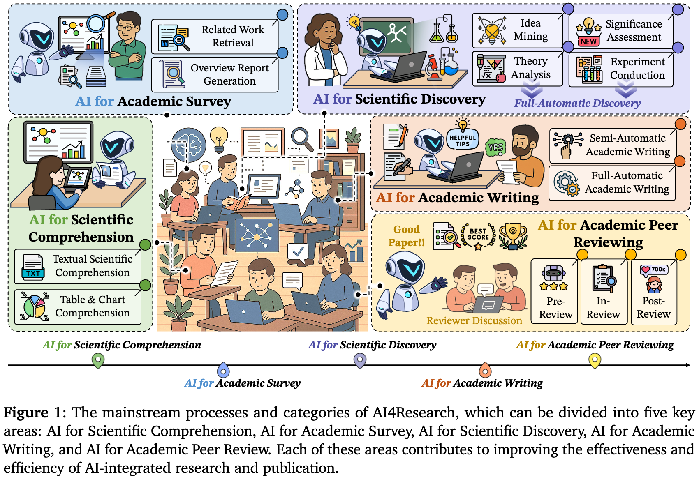

# Awesome-AI4Research-Scientific-Discovery
Awesome-AI4Research / Scientific-Discovery is a curated collection of AI-driven tools, papers, and projects focused on advancing scientific discovery.

🚧 **Work in Progress** — This repository is **continuously updated** with the latest papers, tools, and projects in AI for scientific discovery. Contributions and suggestions are very welcome! ✨

## Table of Contents
<!--ts-->
* [Overview](#overview)
* [Structure](#structure)
* [Contributing](#contributing)
* [LLM as Tool](#llm-as-tool)
  * [AI for Academic Writing](#ai-for-academic-writing)
  * [AI for Academic Idea](#ai-for-academic-idea)
  * [AI for Academic Review](#ai-for-academic-review)
* [LLM as Scientist](#llm-as-scientist)
  * [AI Scientist](#ai-scientist)
* [Evaluation (Other Related Works)](#evaluationother-related-works)
<!--te-->

---

## Overview

This repository serves as a comprehensive resource for researchers, practitioners, and enthusiasts interested in leveraging AI to drive scientific breakthroughs. It includes:
- Summaries and key insights from impactful research papers.
- Open-source projects and code implementations.
- Tools and frameworks for AI-based scientific discovery, including **Research Agents**, **Hypothesis Generation**, **Literature Review Agents**, and **AI-assisted Paper Writing**，etc.

The collection is regularly updated with new papers, implementations, and innovative approaches in AI for scientific applications.

## Structure

- **Research Papers**: A selection of key papers on AI methodologies applied to scientific discovery, including machine learning, deep learning, reinforcement learning, and more.
- **Projects & Implementations**: Open-source AI research projects that showcase real-world applications of AI in science.
- **Tools & Frameworks**: Libraries and tools designed to assist researchers in utilizing AI for scientific applications.

## Contributing

We welcome contributions to expand and enrich this repository. If you know of any relevant papers, projects, or tools that should be included, feel free to open a pull request!

---
## LLM as Tool
### AI for Academic Writing
1. **Writing without borders: AI and cross-cultural convergence in academic writing quality** [NATURE 2025]
   - **Paper**: [humanities and social sciences communications](https://www.nature.com/articles/s41599-025-05484-6?referrer=grok.com).

2. **SurveyX: Academic Survey Automation via Large Language Models** [KDD 2025]
   - **Paper**: [arXiv:2502.14776](https://arxiv.org/abs/2502.14776)
   - **GitHub**: [SurveyX](https://github.com/IAAR-Shanghai/SurveyX). 

3. **Towards AI-assisted Academic Writing** [ACL workshop 2025]
   - **Paper**: [arXiv:2503.13771](https://arxiv.org/abs/2503.13771).

4. **LitLLMs, LLMs for Literature Review: Are we there yet?** [2025]
   - **Paper**: [arXiv:2412.15249](https://arxiv.org/abs/2412.15249)
   - **GitHub**: [LitLLM](https://github.com/LitLLM/LitLLM). 

5. **AutoSurvey: Large Language Models Can Automatically Write Surveys** [NeurIPS 2024]
   - **Paper**: [arXiv:2406.10252](https://arxiv.org/abs/2406.10252)
   - **GitHub**: [LitLLM](https://github.com/AutoSurveys/AutoSurvey). 

6. **AutoSurvey: Large Language Models Can Automatically Write Surveys** [2024]
   - **Paper**: [arXiv:2409.13740](https://arxiv.org/abs/2409.13740)
   - **GitHub**: [PaperQA2](https://github.com/future-house/paper-qa). 

7. **Context-Aware Hierarchical Taxonomy Generation for Scientific Papers via LLM-Guided Multi-Aspect Clustering** [2025]
   - **Paper**: [arXiv:2509.19125](https://arxiv.org/abs/2509.19125). 

### AI for Academic Idea
1. **Scientific Hypothesis Generation and Validation: Methods, Datasets, and Future Directions** [2025]
   - **Paper**: [arXiv:2505.04651](https://arxiv.org/abs/2505.04651).

2. **A Survey on Hypothesis Generation for Scientific Discovery in the Era of Large Language Models** [2025]
   - **Paper**: [arXiv:2504.05496](https://arxiv.org/abs/2504.05496).

3. **SciAgents: Automating scientific discovery through multi-agent intelligent graph reasoning** [2024]
   - **Paper**: [arXiv:2409.05556](https://arxiv.org/abs/2409.05556).

4. **Improving Scientific Hypothesis Generation with Knowledge Grounded Large Language Models** [2024]
   - **Paper**: [arXiv:2411.02382](https://arxiv.org/abs/2411.02382).

5. **Spark: A System for Scientifically Creative Idea Generation** [2025]
   - **Paper**: [arXiv:2504.20090](https://arxiv.org/abs/2504.20090).   

6. **ResearchAgent: Iterative Research Idea Generation over Scientific Literature with Large Language Models** [NACL 2025]
   - **Paper**: [arXiv:2404.07738](https://arxiv.org/abs/240407738).      

7. **Towards Agentic AI for Science Hypothesis Generation, Comprehension, Quantification, and Validation** [2025]
   - **Paper**: [doi/10.1145/3701716.3718485](https://dl.acm.org/doi/10.1145/3701716.3718485). 

### AI for Academic Review
1. **DeepReview: Improving LLM-based Paper Review with Human-like Deep Thinking Process** [ACL 2025]
   - **Paper**: [arXiv:2503.08569](https://arxiv.org/abs/2503.08569).

2. **Large language models for automated scholarly paper review: A survey** [2025]
   - **Paper**: [arXiv:2501.10326](https://arxiv.org/abs/2501.10326). 

3. **OpenNovelty: An LLM-powered Agentic System for Verifiable Scholarly Novelty Assessment** [2026]
   - **Paper**: [arXiv:2601.01576](https://arxiv.org/abs/2601.01576).

4. **AgentReview: Exploring Peer Review Dynamics with LLM Agents** [EMNLP 2024]
   - **Paper**: [arXiv:2412.15249](https://arxiv.org/abs/2412.15249)
   - **GitHub**: [AgentReview](https://github.com/Ahren09/AgentReview). 

5. **Large language models for automated scholarly paper review A survey** [2025]
   - **Paper**: [arXiv:2501.10326](https://arxiv.org/abs/2501.10326). 

6. **What Can Natural Language Processing Do for Peer Review?** [2024]
   - **Paper**: [arXiv:2409.13740](https://arxiv.org/abs/2405.06563). 

---

## LLM as Scientist
### AI Scientist
1. **The AI Scientist: Towards Fully Automated Open-Ended Scientific Discovery** [2024]
   - **Paper**: [arXiv:2408.06292](https://arxiv.org/abs/2408.06292)
   - **GitHub**: [AI Scientist](https://github.com/SakanaAI/AI-Scientist). 

2. **The AI Scientist-v2: Workshop-Level Automated Scientific Discovery via Agentic Tree Search** [2025]
   - **Paper**: [arXiv:2504.08066](https://arxiv.org/abs/2504.08066)
   - **GitHub**: [AI Scientist-v2](https://github.com/SakanaAI/AI-Scientist-v2?tab=readme-ov-file). 

3. **Agent Laboratory: Using LLM Agents as Research Assistants** [2025]
   - **Paper**: [arXiv:2501.04227](https://arxiv.org/abs/2501.04227)
   - **GitHub**: [Agent Laboratory](https://github.com/SamuelSchmidgall/AgentLaboratory/tree/main). 

4. **AI-Researcher: Autonomous Scientific Innovation** [2025]
   - **Paper**: [arXiv:2505.18705](https://arxiv.org/abs/2505.18705)
   - **GitHub**: [AI Scientist-v2](https://github.com/HKUDS/AI-Researcher). 

5. **DEEPSCIENTIST: ADVANCING FRONTIER-PUSHING SCIENTIFIC FINDINGS PROGRESSIVELY** [2025]
   - **Paper**: [arXiv:2509.26603](https://arxiv.org/abs/2509.26603)
   - **GitHub**: [AI Scientist-v2](https://github.com/ResearAI/DeepScientist/). 

6. **AI4Research: A Survey of Artificial Intelligence for Scientific Research** [2025]
   - **Paper**: [arXiv:2507.01903](https://arxiv.org/abs/2507.01903)

7. **How Far Are AI Scientists from Changing the World?** [2025]
   - **Paper**: [arXiv:2507.23276](https://arxiv.org/abs/2507.23276)

---

## Evaluation(Other Related Works)

1. **Evaluating Large Language Models in Scientific Discovery** [2025]
   - **Paper**: [arXiv:2512.15567](https://arxiv.org/abs/2512.15567).
